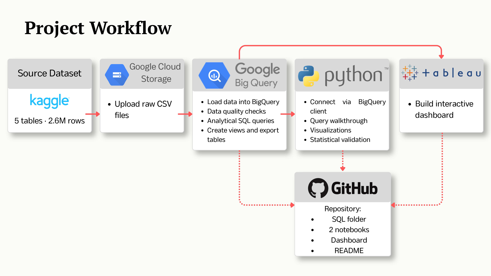

# Retail Customer Basket Analysis

End-to-end analytics project based on the **dunnhumby – The Complete Journey** dataset.  
The project explores customer shopping behavior, basket structure, demographic differences, 
and coupon-related patterns using **BigQuery, Python, and Tableau**.



---

## Table of Contents

- [Dataset](#dataset)
- [Tools & Technologies](#tools--technologies)
- [Repository Structure](#repository-structure)
- [Analytical Questions](#analytical-questions)
- [Notebook Structure](#notebook-structure)
- [Key Findings](#key-findings)
- [Business Recommendations](#business-recommendations)
- [Interactive Dashboard](#interactive-dashboard)
- [How to Reproduce](#how-to-reproduce)
- [Final Deliverables](#final-deliverables)

---

## Dataset

**Source:** [dunnhumby — The Complete Journey](https://www.kaggle.com/datasets/frtgnn/dunnhumby-the-complete-journey)  
**Format:** Multi-table retail dataset with household-level transactions and demographics  
**Scale:** 2,595,732 transaction rows across 5 related tables collected over ~711 days

| Table | Rows | Description |
|---|---|---|
| transaction_data | 2,595,732 | Purchases, basket IDs, spend, quantity |
| product | 92,353 | Product categories and descriptions |
| hh_demographic | 801 | Household demographic attributes |
| coupon_redempt | 2,318 | Coupon redemption behavior |
| campaign_table | 7,208 | Campaign definitions |

---

## Tools & Technologies

| Tool | Role |
|---|---|
| Google Cloud Storage | Raw CSV file storage and BigQuery data source |
| BigQuery / SQL | Data cleaning, joins, aggregations, metric calculation |
| Python (pandas, matplotlib, seaborn, plotly, scipy) | Validation, visual analysis, statistical testing |
| Tableau | Interactive dashboard for business-facing presentation |

---

## Repository Structure
```
Retail-Customer-Basket-Analysis/
│
├── README.md
│
├── sql/
│   ├── 1_data_quality/          # Row counts, null checks, duplicate checks, join coverage
│   ├── 2_views/                 # transactions_clean and basket_summary view definitions
│   ├── 3_analytical_questions/  # 18 queries across 4 analytical blocks
│   └── 4_tableau_exports/       # Tables prepared for Tableau ingestion
│
├── 01_retail_basket_analysis.ipynb                       # Data quality + analytical questions
├── 02_visualizations_and_statistical_validation.ipynb    # Hypothesis testing + vizualisations
│
├── dashboard_preview.png
│
└── project_workflow.png
```

---

## Analytical Questions

**Block 1 - Retail Performance**
1. Which product categories generate the highest revenue and transaction volume?
2. What does the basket value distribution look like, and what are the average and median basket values?
3. What is the average number of items per basket, and which categories appear most often in large baskets?

**Block 2 - Customer Segmentation**

4. How does spending behavior differ across age groups?
5. Which income groups generate the highest revenue and largest average baskets?
6. Do households with children shop differently from those without?
7. Which households shop most frequently, and do loyal shoppers also have the highest basket values?

**Block 3 - Campaign Impact**

8. Do coupon households show different spending behavior compared to non-coupon households?

**Block 4 - Category Preferences**

9. Which product categories are most preferred across demographic segments?

**Block 5 - Statistical Validation**

10. Is the difference in basket value across income groups statistically significant?

---

## Notebook Structure

### 1. Data Quality & SQL Analysis (`01_retail_basket_analysis.ipynb`)
- Data quality checks across all 5 tables
- Filtering of invalid transaction rows via `transactions_clean` view
- Basket-level aggregation via `basket_summary` view
- Category-level revenue analysis
- Segmentation by age, income, and household composition
- Coupon vs non-coupon spending comparison
- Business recommendations

### 2. Statistical Validation & Visual Analysis (`02_visualizations_and_statistical_validation.ipynb`)
- Basket value distribution analysis
- Box plots by income group
- Correlation heatmap across household metrics
- Combined age group × kid category heatmap
- Kruskal-Wallis test to validate income-based basket value differences

---

## Key Findings

**Retail Performance**
- GROCERY dominates with **50.8% of total revenue** - the store is fundamentally a grocery retailer
- Median basket value is **$17.18** - most customers make small, frequent trips
- Average items per basket is **7** after excluding KIOSK-GAS outliers

**Customer Segmentation**
- **35-44 age group** generates the highest revenue per household ($6,402)
- Income is a strong predictor of basket value — median ranges from **$13.24 (25-34K)** to **$34.79 (250K+)**
- Households with **3+ children** spend 35% more per basket than average
- **Visit frequency** is the primary driver of total customer value (r = 0.70)

**Campaign Impact**
- Coupon households generate **35.6% of revenue** from just 17% of customers
- Coupon users spend **33% more per basket** and visit twice as frequently

**Statistical Validation**
- Kruskal-Wallis test confirms income-based basket value differences are 
statistically significant (H = 6049.47, p ≈ 0.00)
- Basket diversity is the strongest predictor of basket value (r = 0.91)

---

## Business Recommendations

1. Prioritize **GROCERY and DRUG GM** for promotions and loyalty mechanics - 
they account for ~64% of revenue across all demographic segments
2. Focus basket-growth strategies on **family households with children** - 
they consistently show 35% higher basket values than average
3. Design loyalty programs around **repeat visits**, not only spend thresholds - 
high loyalty households drive 64% of revenue through frequency
4. Expand **coupon engagement** strategically - coupon users are the most 
valuable customer segment by revenue contribution per household
5. Use **income segmentation** for targeted promotions - the 2.6x basket value 
difference across income groups is statistically confirmed

---

## Interactive Dashboard

🔗 [View Dashboard on Tableau Public](https://public.tableau.com/views/RetailCustomerBehaviorAnalysis_17744528551900/RetailCustomerBehaviorAnalysis?:language=en-US&:sid=&:redirect=auth&:display_count=n&:origin=viz_share_link)

The dashboard includes 5 KPI cards, 5 interactive charts, and 3 global filters.

**KPI cards** (Total Revenue, Total Households, Coupon Households, Total Baskets, 
Avg Basket Value) reflect all **2,500 households**.

**Demographic charts** (Basket Value by Income Group, Spending by Age Group, 
Coupon vs Non-Coupon, Loyalty Tier Revenue) are based on **801 households** 
with available demographic data (32% of total) and respond to all three 
global filters: Age Group, Income Group, and Coupon Household.

**Revenue by Category** reflects the full dataset and is not affected 
by the demographic filters.


---

## How to Reproduce

1. Open the SQL files in the `sql/` folder and run them in BigQuery in this order:
   - `1_data_quality/` — validate the raw data
   - `2_views/` — create `transactions_clean` and `basket_summary`
   - `3_analytical_questions/` — run business question queries
   - `4_tableau_exports/` — prepare tables for Tableau
2. Run the Python notebooks in order from the repository root:
   - `01_retail_basket_analysis.ipynb`
   - `02_visualizations_and_statistical_validation.ipynb`

> Note: BigQuery credentials are not included in this repository.  
> Add your own Google Cloud service account JSON file to the 
> **root folder** of the repository and update `CREDENTIALS_FILE` 
> in the first cell of each notebook.

---

## Final Deliverables

- SQL query set organized across 4 logical folders in BigQuery
- 2 analytical Jupyter notebooks with findings and recommendations
- Interactive Tableau dashboard
- GitHub repository with full documentation

---

## Author

**Diana Shevchenko**  
[LinkedIn](www.linkedin.com/in/shevchenko-diana)
